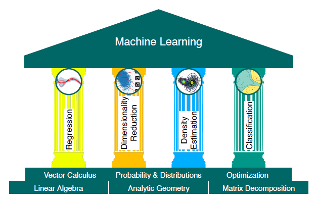

# Matemáticas para Inteligencia Artificial

Las matemáticas que hay debajo de la IA, explicadas con código que puedes ejecutar.
Cada tema viene resuelto en **Python**, con notebooks y scripts cortos, comentados y autocontenidos.

Material abierto y gratuito.



---

## ¿Para quién es esto?

- Quien aprende IA por su cuenta y se topa con la pared del álgebra lineal o el cálculo.
- Quien programa modelos pero quiere entender qué pasa dentro del `fit()`.
- Quien estudia una ingeniería o posgrado y quiera entender el fundamento teórico.
- Quien enseña estos temas y quiere ejercicios listos para adaptar (la licencia lo permite).

**Lo que se da por sabido:** álgebra de bachillerato y nociones básicas de programación.
Lo demás se construye desde cero en los propios scripts.

## Ruta de aprendizaje

Los módulos están pensados para seguirse en orden, pero cada script funciona por separado.

### 1 · Álgebra lineal y geometría diferencial
Vectores, matrices, normas, producto punto, sistemas de ecuaciones, espacio nulo, rango,
determinantes, valores y vectores propios, descomposiciones y transformaciones. Es el lenguaje en el
que se escriben los datos y los pesos de una red.

| Notebook | Abrir sin instalar nada |
|---|---|
| [00 · Propiedades de matrices: suma, multiplicación, identidad y transpuesta](python/01-algebra-lineal/00_propiedades_matrices.ipynb) | [](https://colab.research.google.com/github/SolKacil/matematicas-para-ia/blob/main/python/01-algebra-lineal/00_propiedades_matrices.ipynb) |
| [01 · Vectores y espacios vectoriales](python/01-algebra-lineal/01_vectores_y_espacios_vectoriales.ipynb) | [](https://colab.research.google.com/github/SolKacil/matematicas-para-ia/blob/main/python/01-algebra-lineal/01_vectores_y_espacios_vectoriales.ipynb) |
| [02 · Sistemas lineales: solución general, espacio nulo y rango](python/01-algebra-lineal/02_sistemas_lineales_y_espacio_nulo.ipynb) | [](https://colab.research.google.com/github/SolKacil/matematicas-para-ia/blob/main/python/01-algebra-lineal/02_sistemas_lineales_y_espacio_nulo.ipynb) |
| [03 · Determinante, norma, producto punto y ortogonalidad](python/01-algebra-lineal/03_determinante_norma_producto_punto.ipynb) | [](https://colab.research.google.com/github/SolKacil/matematicas-para-ia/blob/main/python/01-algebra-lineal/03_determinante_norma_producto_punto.ipynb) |
| [04 · Autovalores y autovectores](python/01-algebra-lineal/04_autovalores_y_autovectores.ipynb) | [](https://colab.research.google.com/github/SolKacil/matematicas-para-ia/blob/main/python/01-algebra-lineal/04_autovalores_y_autovectores.ipynb) |

Cada tema trae además un PDF con la teoría — definiciones, demostraciones y ejercicios resueltos —
en la misma carpeta del notebook y enlazado desde él: [`Matematicas_para_IA_00.pdf`](python/01-algebra-lineal/Matematicas_para_IA_00.pdf)
a [`Matematicas_para_IA_04.pdf`](python/01-algebra-lineal/Matematicas_para_IA_04.pdf).

📁 [`python/01-algebra-lineal`](python/01-algebra-lineal)

### 2 · Cálculo multivariable y optimización
Derivadas parciales, gradiente, regla de la cadena, matrices jacobiana y hessiana, descenso de gradiente.
Aquí está el motor del entrenamiento: retropropagación y minimización de la función de pérdida.
📁 [`python/02-calculo-optimizacion`](python/02-calculo-optimizacion)

### 3 · Teoría de grafos y procesos estocásticos
Grafos, matrices de adyacencia, recorridos, cadenas de Markov y probabilidad aplicada.
La base de las redes neuronales de grafos, los sistemas de recomendación y el aprendizaje por refuerzo.
📁 [`python/03-grafos-y-procesos-estocasticos`](python/03-grafos-y-procesos-estocasticos)

### 4 · Análisis numérico y transformada de Fourier
Error numérico, interpolación, integración, raíces, series y transformada de Fourier (DFT/FFT).
Indispensable para trabajar señales, audio, imágenes y series de tiempo.
📁 [`python/04-analisis-numerico-y-fourier`](python/04-analisis-numerico-y-fourier)

## Material de lectura

Dos cosas distintas, en dos lugares distintos.

**La teoría de cada unidad está junto a su código**, en `python/`: un PDF de notas de estudio por
tema, en la misma carpeta que el notebook y enlazado desde él. Son las definiciones, las
demostraciones y los ejercicios resueltos que el notebook da por vistos. De la unidad I están
publicados los cinco: `python/01-algebra-lineal/Matematicas_para_IA_00.pdf` … `_04.pdf`.

**Las fuentes externas están en [`Recursos/`](Recursos):**

- 📁 [`Recursos/Libros`](Recursos/Libros) — los seis libros de referencia del curso. Los PDF no se
  versionan (derechos de autor y más de 200 MB); el
  [README de la carpeta](Recursos/Libros/README.md) lista cada libro, dice dónde conseguirlo
  y en qué módulo se usa. Tres son de descarga libre y oficial: *Mathematics for Machine
  Learning*, *Deep Learning* de Goodfellow y el *Pattern Recognition and Machine Learning* de
  Bishop.
- 📁 [`Recursos/papers-ia`](Recursos/papers-ia) — tres artículos fundacionales, para leer cuando
  el álgebra lineal ya se sostenga sola y quieras ver para qué sirve:
  - *Attention Is All You Need* (Vaswani et al., 2017) — el Transformer · [arXiv:1706.03762](https://arxiv.org/abs/1706.03762)
  - *An Image Is Worth 16x16 Words* (Dosovitskiy et al., 2020) — el Transformer aplicado a visión · [arXiv:2010.11929](https://arxiv.org/abs/2010.11929)
  - *Long Short-Term Memory* (Hochreiter y Schmidhuber, 1997) — las redes recurrentes con memoria · [JKU Linz](https://www.bioinf.jku.at/publications/older/2604.pdf)

## Empezar

### Sin instalar nada: Google Colab

Cada notebook lleva arriba un botón **Open in Colab**. Le das clic y el material se abre y se
**ejecuta en tu navegador**, gratis, sin instalar Python ni nada. Es la forma más rápida de
empezar y la recomendada si estás aprendiendo.

### En tu computadora

```bash
git clone https://github.com/SolKacil/matematicas-para-ia.git
cd matematicas-para-ia

python -m venv .venv
.venv\Scripts\activate          # Windows
source .venv/bin/activate       # Linux / macOS

pip install -r requirements.txt
python python/01-algebra-lineal/00_propiedades_matrices.py
```

## Cómo estudiar con este repositorio

1. Lee el encabezado del script: dice qué concepto trabaja y qué deberías obtener.
2. Ejecútalo tal cual y compara la salida con lo que esperabas.
3. Cambia los números de entrada y vuelve a correrlo. Ahí es donde se aprende.
4. Reescribe la parte central sin usar la función de la biblioteca (tu propio producto punto,
   tu propio descenso de gradiente) y verifica que coincida con la versión de NumPy.

## Estructura

```
python/     notebooks .ipynb, scripts .py y los PDF de teoría, una carpeta por módulo
Recursos/   material de lectura externo
  Libros/     libros de referencia (solo el README con los enlaces; los PDF no se versionan)
  papers-ia/  artículos fundacionales de IA
datos/      conjuntos de datos que comparten los ejercicios
assets/     imágenes y material de apoyo
```

## Convenciones

- `NN_tema_descriptivo.py` y `NN_tema_descriptivo.ipynb`, con `NN` consecutivo dentro
  del módulo (`01_`, `02_`, …). El notebook explica el tema; el script es el mismo contenido
  reducido a lo ejecutable.
- Cada ejercicio abre con un encabezado: título, módulo y objetivo.
- Los datos de entrada van en `datos/`; las salidas generadas (figuras) no se versionan.
- Sin acentos ni espacios en los nombres de archivo y carpeta; los acentos van en el contenido.
  Excepción: los archivos de `Recursos/` conservan el nombre con el que se publicaron.

## Contribuir

Se aceptan correcciones, ejercicios nuevos, traducciones y mejoras a las explicaciones.
Lee [CONTRIBUTING.md](CONTRIBUTING.md) — es corto.

## Licencia y autoría

[MIT](LICENSE): puedes usar, copiar, modificar y redistribuir el material, incluso en cursos propios,
conservando el aviso de atribución.

Escrito y mantenido por **Dr. Oscar Isaid Pellico Sánchez**, docente de ingeniería.
El contenido nace de un curso universitario que imparto, reordenado aquí para que sirva a cualquiera.
